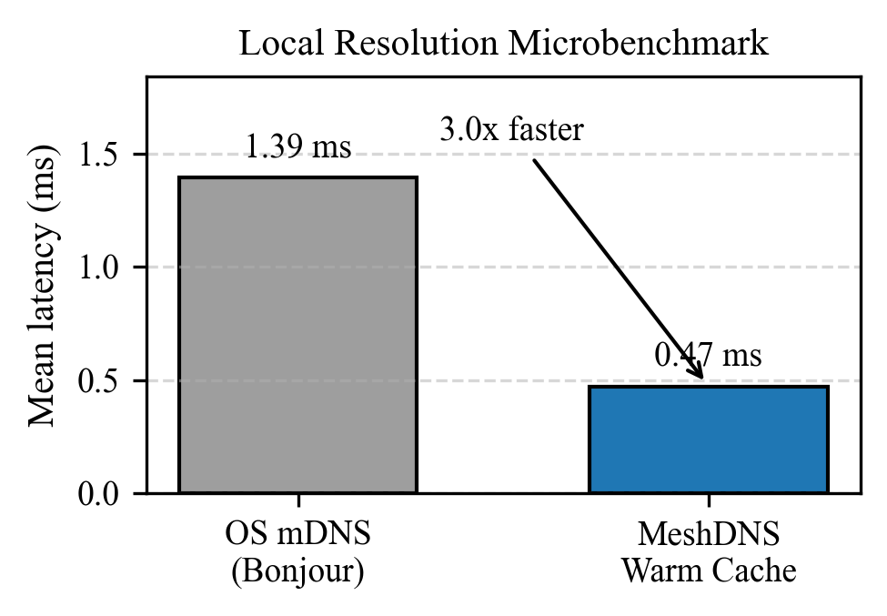
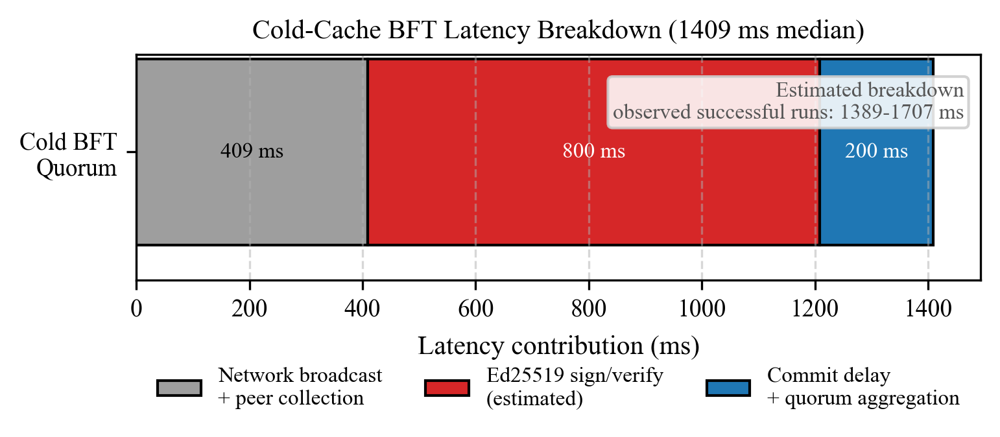
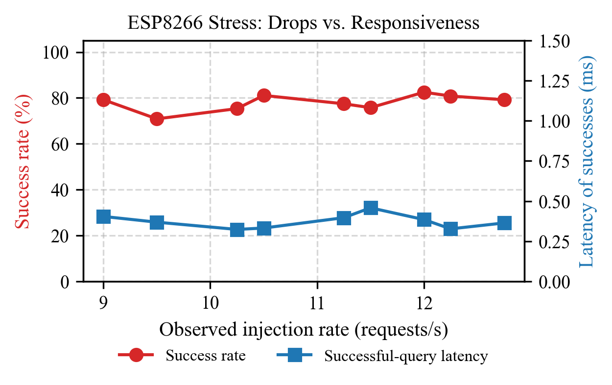

# MeshDNS Artifact

MeshDNS is a cooperative DNS resolution framework for resource-constrained IoT networks. It replaces a single centralized resolver with a mesh of admitted nodes that share cache awareness through hash-based summaries and protect cold-cache misses with Ed25519-signed, identical-answer quorum voting. The prototype targets commodity ESP8266-class devices and was evaluated with a 5-node physical testbed plus simulations up to 1,000 nodes.

This repository is being prepared as a research preview. At this stage it contains the empirical research data, benchmark scripts, simulation code, and reproduction notes used for the MeshDNS evaluation. Firmware files will be added to this repository soon; until then, firmware-specific steps in the benchmark docs describe the expected configuration interface and test modes.

## Key Results

<table>
  <tr>
    <td></td>
    <td></td>
    <td></td>
  </tr>
</table>

## Repository Layout

- `benchmark/test_scripts/` contains hardware test scripts and benchmark runners.
- `benchmark/` contains curated result notes, scenario templates, and reproduction runbooks.
- `benchmark/results/` contains archived empirical hardware and simulation outputs.
- `benchmark_figures/` contains extracted plotting data for paper figures.
- `sim/` contains discrete-event simulation and adversarial evaluation code.

## Reproducing Results

Start with `benchmark/BENCHMARK_RUNBOOK.md`. It describes the canonical hardware workflow, required host dependencies, network assumptions, command ports, and result files.

For adversarial experiments, use `benchmark/ADVERSARIAL_EVAL.md` after completing the base runbook setup. The adversarial guide explains the f=0/f=1/f=2 hardware runs, Sybil/equivocation scenarios, and how to keep lab-specific IP addresses out of committed scripts.

Most hardware commands require you to provide your own LAN values:

```bash
export MESHDNS_BROADCAST=192.168.1.255
export MESHDNS_TARGET_DOMAIN=lab-target.local
export MESHDNS_TARGET_IP=192.168.1.10
export MESHDNS_NODES=192.168.1.21,192.168.1.22,192.168.1.23,192.168.1.24,192.168.1.25
export MESHDNS_RESOLVER=192.168.1.22
```

Simulation-only experiments do not require ESP8266 hardware:

```bash
python3 sim/adversarial_evaluation.py --suite all --quick
```

## Notes For Reviewers

The archived result folders intentionally preserve the IP addresses and hostnames observed during the original lab runs because they are raw empirical data. Reproduction guides and scripts use placeholders or environment variables so independent testers can run the same workflow on their own subnet.

## License

The source code, benchmarking tools, and simulation scripts in this repository are licensed under the **MIT License**. See `LICENSE`.

The empirical datasets, hardware performance logs, and generated graph-coordinate data located in `benchmark/results/` and `benchmark_figures/` are licensed under the **Creative Commons Attribution 4.0 International License (CC BY 4.0)**. Local license notices are included in those directories. You are free to share and adapt these datasets, provided you give appropriate credit by citing the original MeshDNS manuscript.
